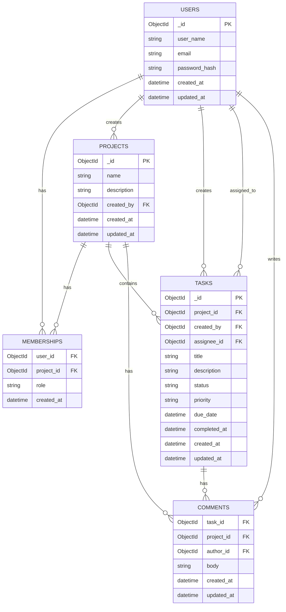

# TaskFlow

TaskFlow is a collaborative task-management backend for teams working within projects. It supports account authentication, project creation, owner-managed memberships, and project-scoped tasks with assignment, status, priority, due-date, search, sorting, and pagination support. The current repository contains the backend service; a web client, comments, and real-time delivery are planned but are not implemented yet.

> **API reference:** endpoint contracts, request/response examples, and error details live in [server/API_DOCUMENTATION.md](server/API_DOCUMENTATION.md). This README focuses on running, architecture, and project status.

## Capabilities

- JWT-based signup, login, profile lookup, token refresh, and logout.
- Project access limited to members; project updates, deletion, and member administration limited to owners.
- Tasks scoped to a project, with member-only access and same-project assignee validation.
- MongoDB persistence with a reusable connection client and configurable pool settings.

## Run locally

The steps below are intended for a clean clone. The service requires Python 3.14 or later, [uv](https://docs.astral.sh/uv/), and a reachable MongoDB deployment (local MongoDB or Atlas).

1. Clone the repository and enter the backend directory.

   ```bash
   git clone <your-repository-url> TaskFlow
   cd TaskFlow/server
   ```

2. Create the local environment file.

   ```powershell
   Copy-Item .env.example .env
   ```

3. Edit `.env` and provide all required values. Use a strong, random `JWT_SECRET_KEY`; never commit this file.

   ```dotenv
   MONGODB_URL=mongodb+srv://<user>:<password>@<cluster>/<database>?retryWrites=true&w=majority
   DATABASE_NAME=taskflowDB
   MONGO_MAX_POOL_SIZE=50
   MONGO_MIN_POOL_SIZE=10
   MONGO_TIMEOUT_MS=5000
   BCRYPT_ROUNDS=12
   JWT_SECRET_KEY=<long-random-secret>
   ALGORITHM=HS256
   COLLECTION=users
   ```

4. Install the locked dependencies and start the development server.

   ```bash
   uv sync
   uv run uvicorn src.main:app --reload
   ```

5. Confirm the service is running at `http://127.0.0.1:8000`. Interactive API documentation is available at `http://127.0.0.1:8000/docs`.

### Smoke check

In a second terminal, run:

```bash
curl http://127.0.0.1:8000/
```

Expected response:

```json
{"message":"Hello world"}
```

The application validates its MongoDB configuration and connects during startup. If it exits before serving requests, first verify the connection string, network access to MongoDB, and all `.env` values.

## Architecture and data model

TaskFlow uses MongoDB. Documents use MongoDB `ObjectId` values internally; the API serializes them as strings. There are no relational database foreign-key constraints, so application-level permission checks and references enforce the relationships below.



### Relationship and authorization rules

- A user can belong to many projects, and a project can have many users. `memberships` is the join collection and carries the user’s role.
- Creating a project creates an `owner` membership for its creator. Owners alone can edit/delete a project and add/remove members; the owner cannot be removed.
- A task belongs to exactly one project. Any project member may currently create, update, or delete its tasks; an assignee, when present, must be a registered member of that same project.
- Comments are not yet represented by a collection or route. The proposed collection above deliberately stores both `project_id` and `task_id` so authorization and real-time routing can be checked without trusting client input.

Recommended MongoDB indexes for the next iteration are `users.email` (unique), `memberships` compound `{ project_id: 1, user_id: 1 }` (unique), `tasks.project_id`, and a TTL index on `revoked_tokens.expires_at`.

## Technology choices

| Layer | Choice | Why |
| --- | --- | --- |
| API | FastAPI | Typed Pydantic validation, dependency injection for auth, and built-in OpenAPI documentation keep the service explicit and productive. |
| Persistence | MongoDB with PyMongo | Project, membership, and task documents map naturally to flexible document storage; ObjectIds are used for references. |
| Authentication | PyJWT + bcrypt | Short-lived signed access tokens reduce exposure, while bcrypt protects stored passwords. |
| Configuration | Pydantic Settings | Environment validation makes missing or malformed operational configuration fail early. |
| Dependency management | uv | `pyproject.toml` and `uv.lock` provide reproducible local environments. |

## Authentication and refresh tokens

On signup or login, TaskFlow returns two signed JWTs:

- The access token contains `sub` (email), `type: access`, and `exp`; it lasts 15 minutes and is sent as a Bearer token for protected API calls.
- The refresh token contains `sub`, `type: refresh`, a unique `jti`, and `exp`; it lasts 7 days and is supplied only to the refresh/logout endpoints.

The server stores user records in MongoDB, including bcrypt password hashes. It does not persist normal access tokens or normal refresh tokens. Logout writes the refresh token’s `jti` and expiry to `revoked_tokens`; clients should remove both tokens from their storage after logout. For browser clients, the recommended production posture is an HttpOnly, Secure, SameSite refresh-token cookie and an in-memory access token; native clients should use platform secure storage.

When the access token expires, the client sends the refresh token to obtain a new access token. When the refresh token itself expires, the user must authenticate again. **Current limitation:** refresh-token rotation is not implemented, and the revocation lookup is incorrectly gated behind a missing `sub` claim. Because issued refresh tokens include `sub`, logout does not yet guarantee server-side refresh-token invalidation. This should be corrected before production use by checking the `jti` for every refresh request, rotating refresh tokens, and atomically revoking the replaced token.

## WebSockets and real-time events

WebSockets are **not implemented in the current repository**. No socket endpoint, socket authentication, event broadcaster, or reconnect logic exists today. The following is the intended enterprise-grade design, not current behavior:

1. A client opens a WebSocket with a short-lived access JWT in the `Authorization` header during the handshake (or an approved WebSocket subprotocol), never in a query string. The server validates signature, expiry, token type, and that the user still exists before accepting.
2. The server keeps an in-memory connection registry keyed by `project_id`, with each connection associated with the authenticated `user_id`. Joining a project room requires a fresh membership lookup; a client must never select a room merely by naming it.
3. A task/comment mutation first performs its normal authorization and database write. Only after success, the service publishes a narrowly scoped event such as `task.created` or `comment.created` to that project’s room. It sends no event to other project rooms.
4. Disconnect handlers remove the connection from every room and clean up empty rooms. Clients use exponential-backoff reconnects with jitter, re-authenticate on reconnect, and refetch the relevant project/task state after reconnecting to recover events missed while offline.
5. For multiple application instances, replace the process-local broadcaster with Redis Pub/Sub or a managed message broker, while each instance retains only its local sockets. Add event IDs and client-side deduplication for reliable recovery.

## Engineering challenges and approach

The core challenge has been enforcing tenant-like project boundaries consistently: a valid user ID alone must not grant access to a project or make someone a valid task assignee. The implementation addresses this through shared membership/owner checks and validates that assignees belong to the same project. It also centralizes token creation and access-token validation, while keeping secrets and database tuning outside source control through environment settings.

The remaining harder work is moving from request/response collaboration to reliable real-time collaboration. That requires a durable event design, revocation-safe socket authentication, multi-instance fan-out, and reconnect recovery rather than simply adding a WebSocket route.

## Known issues and incomplete work

- No frontend/client application is included.
- Comments and all WebSocket functionality are not implemented.
- Refresh tokens are not rotated, and logout does not reliably enforce server-side refresh-token revocation (see above).
- `GET /projects/{project_id}/tasks` is declared twice in `src/routes/task.py`; FastAPI resolves the first declaration, but the duplicate should be removed.
- Deleting a project removes memberships but currently leaves its tasks orphaned; deletion should be transactional or explicitly cascade to tasks/comments.
- The project has no automated test suite, migration/index bootstrap, health/readiness endpoint, rate limiting, CORS policy, structured observability, or CI pipeline yet.
- A MongoDB transaction strategy is needed to make multi-document changes (for example, project creation plus owner membership) atomic on a replica-set deployment.

## What I would improve with more time

1. Fix refresh-token rotation and revocation, then add integration tests for expired, revoked, malformed, and wrong-token-type credentials.
2. Add comments, the authenticated project-scoped WebSocket architecture described above, Redis-backed fan-out, and event recovery.
3. Add MongoDB indexes, cascade/transactional deletion, audit fields, and a bootstrap process for required indexes.
4. Build a frontend with accessible task views, optimistic updates, and robust token/session handling.
5. Add unit, API integration, authorization, and end-to-end tests; run them through CI with linting, type checking, security scanning, and coverage reporting.
6. Prepare operations for production: strict CORS, rate limits, health checks, secret rotation, centralized logging, metrics, tracing, backups, and deployment automation.

## AI usage and learning

AI was used to assist with project documentation: it reviewed the repository structure and implementation and drafted this README from the verified code paths and documented limitations. The work reinforced an important lesson: AI-generated material must be checked against the code, especially for authentication and real-time claims. A professional README should distinguish what is implemented today from an intended design, document security limitations plainly, and avoid inventing behaviors that users cannot rely on.

## License

This repository is distributed under the terms in [LICENSE](LICENSE).
